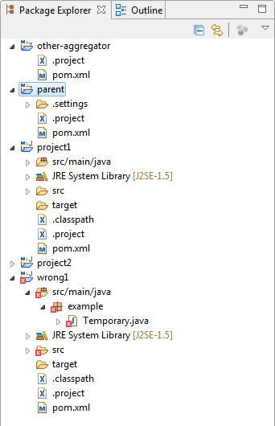
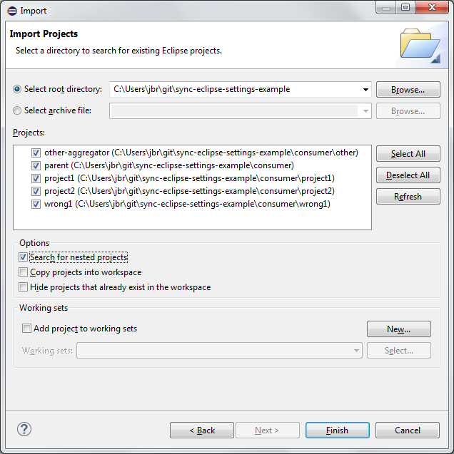
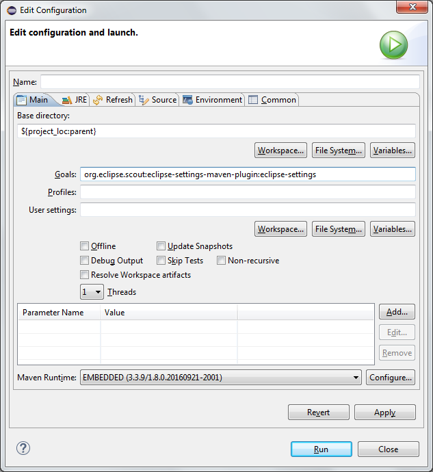
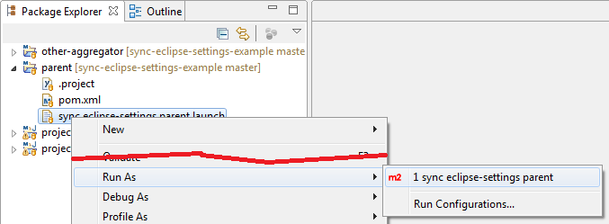

:experimental:
:github-readme: ../README.adoc

include::{github-readme}[tags=vardef]

:projectpage: https://github.com/{git-repository}

include::{github-readme}[tags=header]

== URLs

* link:{homepage}[Project home] (this page)
* link:{projectpage}[GitHub project]
* link:{issues}[Issue tracker]

TIP: Do you want to improve this page? Please git-link:self[edit it on GitHub].

include::{github-readme}[tags=description]

=== Maven structure

From a maven point of view you have:

* a git-link:example-use/pom.xml[parent pom file] and several child artifacts:
  - git-link:example-use/project1/pom.xml[project1 pom file]
  - git-link:example-use/project2/pom.xml[project2 pom file]
  - git-link:example-use/wrong1/pom.xml[wrong1 pom file] (contains a compile error on purpose)
  - git-link:example-use/skipped1/pom.xml[skipped1 pom file] (is not an eclipse project on purpose)
* another aggregator artifact git-link:example-use/other/pom.xml[other pom file] that doesn't have `parent` as parent pom.

To make the maven structure a little more complex, the parent pom only aggregates `project1` and `project2` and not `wrong1`.
The `other` pom aggregates `parent`, `wrong1` and `skipped1`.

`project1` is a dependency of `project2`.

==== Compile at the root

You can compile `parent`, `project1` and `project2` by running maven at inside of the git-link:example-use/[example-use folder]

----
cd example-use
mvn compile
----

You should get a log like this:

----
[INFO] ------------------------------------------------------------------------
[INFO] Reactor Summary:
[INFO]
[INFO] parent ............................................. SUCCESS [  0.011 s]
[INFO] project1 ........................................... SUCCESS [  2.369 s]
[INFO] project2 ........................................... SUCCESS [  0.024 s]
[INFO] ------------------------------------------------------------------------
[INFO] BUILD SUCCESS
[INFO] ------------------------------------------------------------------------
----

==== Compile all projects

Because of the complex aggreation structure, to compile all the projects you need to run maven in the git-link:example-use/other/[other folder].
Only this pom file aggregates all the maven artifacts contained in the example.

----
cd example-use/other
mvn compile
----

For demonstration purpose there is a compile error in the `wrong1` project.
The build result should be:

----
[INFO] -------------------------------------------------------------
[ERROR] COMPILATION ERROR :
[INFO] -------------------------------------------------------------
[ERROR] ***/wrong1/src/main/java/example/Temporary.java:[5,17] not a statement
[ERROR] ***/wrong1/src/main/java/example/Temporary.java:[5,25] ';' expected
[INFO] 2 errors
[INFO] -------------------------------------------------------------
[INFO] ------------------------------------------------------------------------
[INFO] Reactor Summary:
[INFO]
[INFO] parent ............................................. SUCCESS [  0.007 s]
[INFO] project1 ........................................... SUCCESS [  2.219 s]
[INFO] project2 ........................................... SUCCESS [  0.033 s]
[INFO] wrong1 ............................................. FAILURE [  0.775 s]
[INFO] skipped1 ........................................... SKIPPED
[INFO] other .............................................. SKIPPED
[INFO] ------------------------------------------------------------------------
[INFO] BUILD FAILURE
[INFO] ------------------------------------------------------------------------
----

==== Compile each project individually

Of course because all projects are really basic, they can be compiled individually.
To build `project2` you need to have installed `project1` in your local maven repository.

=== Projects in Eclipse IDE

The artifacts can of course be imported into Eclipse IDE.
Each of them is a valid Eclipse project.
The requested metadata files (`.project` and `.classpath`) are contained in the git repository:

If you want to import the projects into Eclipse, just open the _Import_ dialog with menu:File[Import...] and select _Existing Projects into Workspace_ in the import source list.
Indicate the git-link:example-use/[example-use folder] as root directory and in the Options section, make sure that _Search for nested projects_ is checked.
You should see the list of projects and you can materialize them in the workspace with the btn:[Finish] button.

=== Maven plugin usage

==== Setup

The parent project is configured to generate four `*.prefs` files inside each `.settings` folder.

* `org.eclipse.core.resources.prefs`
* `org.eclipse.jdt.core.prefs`
* `org.eclipse.jdt.ui.prefs`
* `org.eclipse.m2e.core.prefs`

This section provides a step-by-step overview of the configuration.
You can also refer directly to the `pluginManagement` section of the git-link:example-use/pom.xml[parent pom].

The configuration is similar to any maven plugin:

[source,xml]
----
include::../example-use/pom.xml[tags="plugin", indent=0]
----

In this example the different `*.prefs` files should be copied from link:http://mvnrepository.com/artifact/org.eclipse.scout.rt/org.eclipse.scout.rt-settings[org.eclipse.scout.rt-settings] artifact of the Eclipse Scout project.
This artifact is defined as a dependency of the `eclipse-settings-maven-plugin` itself (and not of the parent project).

[source,xml]
----
include::../example-use/pom.xml[tags="dep", indent=0]
----

In the configuration section, the location of each `*.prefs` that will be copied to each project is defined.
In this case, the 4 files should be moved to the `.settings` folder.

[source,xml]
----
include::../example-use/pom.xml[tags="config", indent=0]
----

Because the `eclipse-settings-maven-plugin` is configured in the `pluginManagement` section, the configuration will be applied for all children of the parent pom.

There is one exception in the `skipped1` project: this child pom is additionally configured to skip the configuration made in the parent pom.

[source,xml]
----
include::../example-use/skipped1/pom.xml[tags="skip-plugin", indent=0]
----

==== Sync the prefs files

To synchronize the configured `*.prefs` files on a project (existing files will be replaced with the configured one), a single maven call is enough:

----
mvn org.eclipse.scout:eclipse-settings-maven-plugin:eclipse-settings
----

It is possible to call it on a single artifact.
More interesting is to call it on an aggregator pom, the `parent` project or the `other` project in our example.
In this case, the settings files will be synchronized for each module in the maven reactor.

If you call the goal in the git-link:example-use/[parent project] like this:

----
cd example-use
mvn org.eclipse.scout:eclipse-settings-maven-plugin:eclipse-settings
----

The settings files will be synchronized in the `parent`, `project1` and `project2` projects.
The maven log looks like this:

----
[INFO] Scanning for projects...
[INFO] ------------------------------------------------------------------------
[INFO] Reactor Build Order:
[INFO]
[INFO] parent
[INFO] project1
[INFO] project2
[INFO]
[INFO] ------------------------------------------------------------------------
[INFO] Building parent 1.0
[INFO] ------------------------------------------------------------------------
[INFO]
[INFO] --- eclipse-settings-maven-plugin:3.0.3:eclipse-settings (default-cli) @ parent ---
[INFO] Project configured.
[INFO]
[INFO] ------------------------------------------------------------------------
[INFO] Building project1 1.0
[INFO] ------------------------------------------------------------------------
[INFO]
[INFO] --- eclipse-settings-maven-plugin:3.0.3:eclipse-settings (default-cli) @ project1 ---
[INFO] Project configured.
[INFO]
[INFO] ------------------------------------------------------------------------
[INFO] Building project2 1.0
[INFO] ------------------------------------------------------------------------
[INFO]
[INFO] --- eclipse-settings-maven-plugin:3.0.3:eclipse-settings (default-cli) @ project2 ---
[INFO] Project configured.
[INFO] ------------------------------------------------------------------------
[INFO] Reactor Summary:
[INFO]
[INFO] parent ............................................. SUCCESS [  1.462 s]
[INFO] project1 ........................................... SUCCESS [  0.059 s]
[INFO] project2 ........................................... SUCCESS [  0.058 s]
[INFO] ------------------------------------------------------------------------
[INFO] BUILD SUCCESS
[INFO] ------------------------------------------------------------------------
----

If the same goal is called in the git-link:example-use/other/[other project] like this:

----
cd example-use/other
mvn org.eclipse.scout:eclipse-settings-maven-plugin:eclipse-settings
----

The settings files will be synchronized the `parent`, `project1`, `project2` and `wrong1` projects.
This will be the case even if the `wrong1` project cannot be compiled due to a compile error.

In the project `skipped1`, no settings files will be copied, because the project is configured to ignore the configuration made in the parent pom.
The maven log for the `skipped1` artifact looks like this:

----
[INFO] ------------------------------------------------------------------------
[INFO] Building skipped1 1.0
[INFO] ------------------------------------------------------------------------
[INFO]
[INFO] --- eclipse-settings-maven-plugin:3.0.3:eclipse-settings (default-cli) @ skipped1 ---
[INFO] Skipping project settings configuration.
[INFO]
----

In the `other` project, no settings file will be generated, because nothing is configured (`other` do not have `parent` as parent pom).
The maven log for the `other` artifact looks like this:

----
[INFO] ------------------------------------------------------------------------
[INFO] Building other 1.9
[INFO] ------------------------------------------------------------------------
[INFO]
[INFO] --- eclipse-settings-maven-plugin:3.0.3:eclipse-settings (default-cli) @ other ---
[WARNING] No settings specified.
[ERROR] Project not configured.
----

==== Sync the prefs files in Eclipse

Of course you can execute the same maven command inside Eclipse using the user interface.
Select the corresponding `pom.xml` in the Package Explorer (take as example the one in the `parent` Project) and choose menu:Run As[2 Maven build...] in the context menu.
In the _Edit Configuration_ dialog indicate `org.eclipse.scout:eclipse-settings-maven-plugin:eclipse-settings` in the _Goals_ field.

To perform this task quicker, you can run one of the `*.launch` file that are present in the repository.
Select the git-link:example-use/sync%20eclipse-settings%20parent.launch[sync eclipse-settings parent.launch] file in the Package Explorer and select menu:Run As[1 sync eclipse-settings parent].

include::{github-readme}[tags=contact-section]

include::{github-readme}[tags=license-section]

